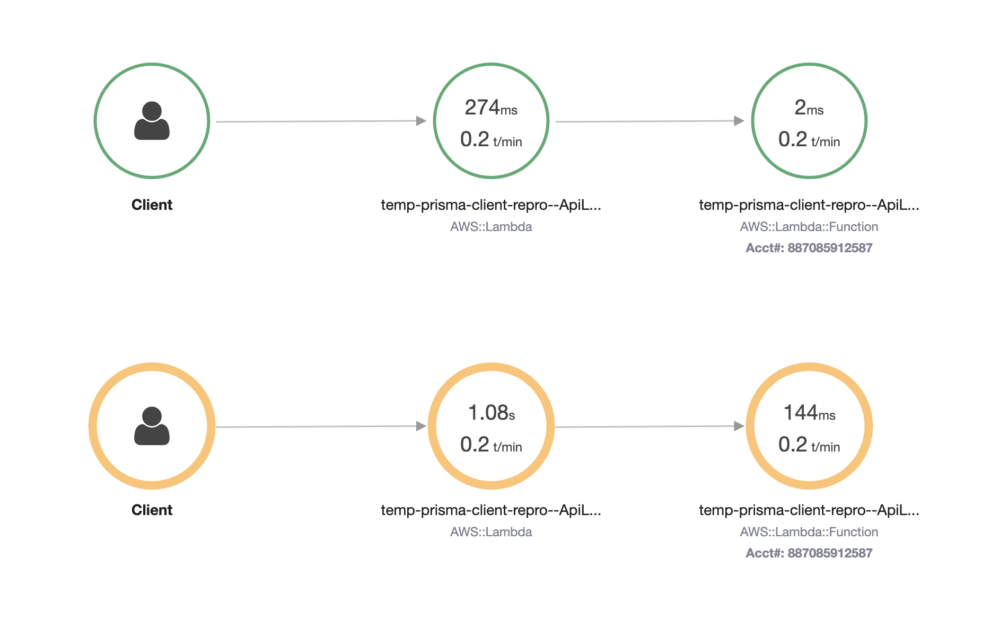

# Prisma lambda cold start profiling

## How to reproduce:

- Configure AWS credentials
- `npm run deploy`

Output will be:

```
Stack temp-prisma-client-repro-my-stack
  Status: deployed
  Outputs:
    ApiEndpoint: https://23wyw3jq4e.execute-api.us-east-1.amazonaws.com
```

- `time curl https://23wyw3jq4e.execute-api.us-east-1.amazonaws.com/no-prisma`
- `time curl https://23wyw3jq4e.execute-api.us-east-1.amazonaws.com/prisma`

- To view precise timing details visit the AWS x-ray console and look at the function traces, specifically the "Initialization" segments:


